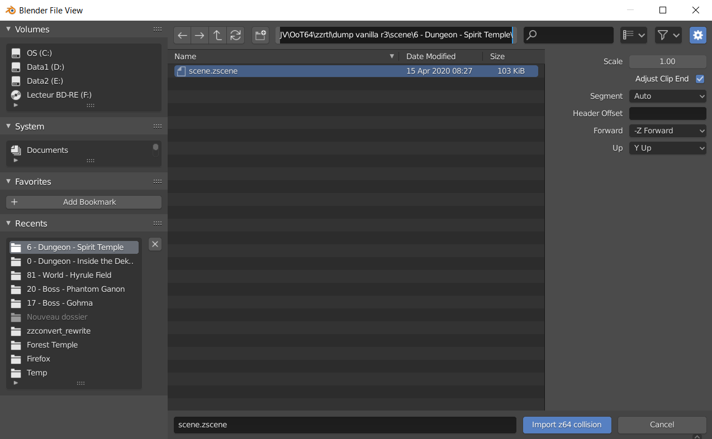
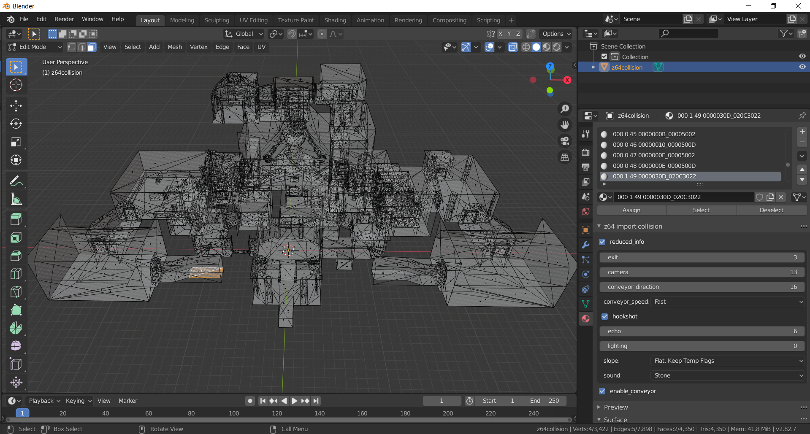
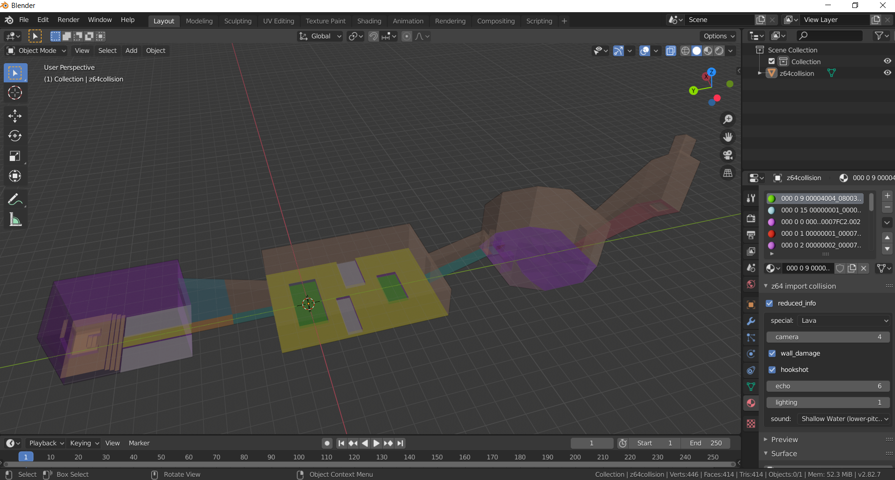
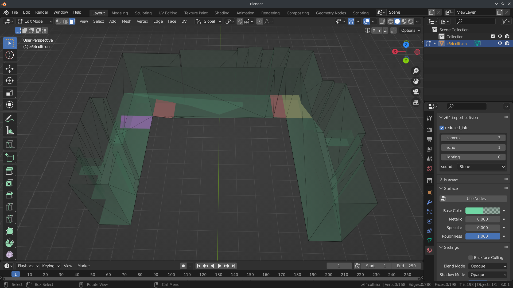

# zelda64-collision-import-blender

A Blender **2.8x** addon for importing collision from `.zscene` and `.zobj` files.

## Collision header offset

The mesh collision header offset is found automatically in `.zscene` files with the `0x03` command in the scene header. (but can still be manually specified if needed)

For `.zobj` files, the header offset must be defined manually in the import options.

## Usage

Materials are created for each unique collision type. Properties are displayed under the `z64 collision` panel. Check `reduced_info` to hide settings set to default values.

I recommend using edit mode and face select mode while having material properties and the `z64 collision` panel in view.

## Screenshots

Screenshot of the import interface:



Screenshot of the Spirit Temple collision with collision settings (in materials) of the child-side exit:



Screenshot of the Royal Tomb collision with colored materials:



## References

Consulted on (around) 2020-08-18

[The Collision Mesh Format page of the CloudModding wiki.](https://wiki.cloudmodding.com/oot/Collision_Mesh_Format)

[The OoT64 decompilation project.](https://github.com/zeldaret/oot) (and especially [mzxrules](https://github.com/mzxrules)' [z_bgcheck.c](https://github.com/mzxrules/oot/blob/z_bgcheck/src/code/z_bgcheck.c) decompilation work)

The `Collision` part of the [zzconvert manual](http://www.z64.me/tools/zzconvert/manual).

## Custom colored materials

After importing some collision, the collision properties can be accessed programatically. A useful application is coloring the materials with your own logic.

The following example sets all materials to a random color solely based on the camera used, also making translucent the ones using the index 3.

```py
import bpy

import random

seed = random.random()

for material in bpy.data.materials:
    collision_props = material.z64_import_mesh_collision # ZELDA64_MaterialMeshCollisionProperties
    if not collision_props.is_import_material:
        continue
    polytype_props = collision_props.polytype # ZELDA64_MaterialMeshCollisionPolytypeProperties
    color_key = seed, polytype_props.camera
    alpha = 0.2 if polytype_props.camera == 3 else 1
    rand = random.Random(color_key)
    material.diffuse_color = [rand.random() for i in range(3)] + [alpha]
    material.specular_intensity = 0
    material.roughness = 1
```

This example running on OoT's back alley day scene can result in:


